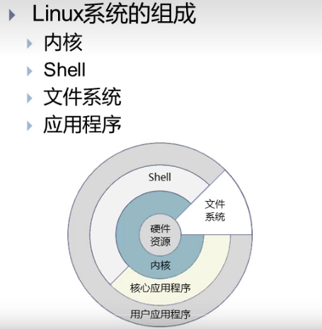
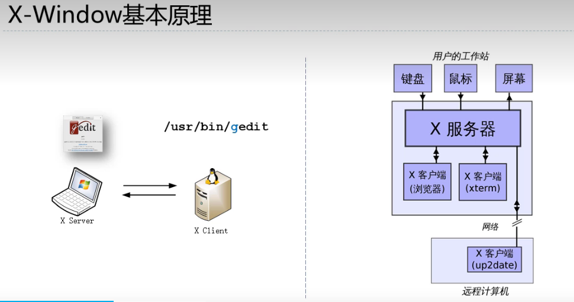

# linux 学习

该文档会用于记录关于对Linux的学习

第一章 背景知识
自由软件：

GNU: gnu's not unix
GNU/linux

## 1.2 GNU/linux 操作系统介绍

- 初始版本 1991年的0.01版本
- 开发者   linus Torvalds
- 内核类别  宏内核
- 用户界面  命令行、图形（x窗口系统、wayland）等多种
- 许可证    GPL



## 1.3 终端命令：虚拟控制的理解

- 命令 采用命令w，可以看到现在采用的是tty7终端

通过ctrl + alt + F1-6 切换不同的控制台，每个控制台是一个独立的显示系统（鼠标和键盘的使用是独立的）

```bash
uisee@uisee-ThinkPad-T470:~/BaseTools/github-project/my-github/linux-studying[main]$ w
 11:38:22 up 54 min,  1 user,  load average: 2.22, 2.94, 2.58
USER     TTY      FROM             LOGIN@   IDLE   JCPU   PCPU WHAT
uisee    tty7     :0               10:44   54:30   5:04   0.29s /sbin/upstart --user
```

安全的ssh
相较于 Telnet(通过wireshake可以进行抓包，甚至可以看到账号和明文密码)，ssh更安全

ssh,需要秘钥相对更安全，并且可以进行ssh 自己的IP

```bash
uisee@uisee-ThinkPad-T470:~$ w
 12:45:12 up  2:01,  3 users,  load average: 4.15, 3.33, 1.90
USER     TTY      FROM             LOGIN@   IDLE   JCPU   PCPU WHAT
uisee    tty1                      11:42    1:03m  0.08s  0.04s -bash
uisee    tty7     :0               10:44    2:01m  6:22   0.35s /sbin/upstart -
uisee    pts/20   192.168.1.14     12:45   11.00s  0.04s  0.04s -bash  // 这个是登录的状态是ssh 登录自己的ip
```

## 1.4 shell简介

- shell 是系统的用户界面
- shell提供了用户与内核进行交互操作的一种接口
- shell接收用户输入的命令并把它送入内核去执行

shell可以处理的内容：

- linux命令      /bin、、/sbin（超级管理员使用的命令）
- 内置命令        构建在shell内部的常用命令
- 使用程序        /usr/下bin、 sbin、share、local/bin等目录下的使用程序或者工具
- 用户程序        用户程序经过编译生成可执行的文件
- shell脚本      用shell语言编写的批处理文件

如果不是内置命令：
情况1：明确给出命令的路径
/usr/bin/python
情况2：没有给出命令的路径
在系统环境变量中查找，通过`echo $PATH`得到环境变量（目录字符串，字符串通过: 分割）。

```bash
uisee@uisee-ThinkPad-T470:~$ echo $PATH
/home/uisee/anaconda3/condabin:/home/uisee/bin:/home/uisee/.local/bin:/usr/local/sbin:/usr/local/bin:/usr/sbin:/usr/bin:/sbin:/bin:/usr/games:/usr/local/games:/snap/bin
```

---
---


# 第二章 文件
一切皆文件

- 普通文件  Regular file (-)
- 目录文件  Directory  (d)
- 硬链接    Hard link  ()
- 软连接    symbolic link (l)
- 设备文件  Device File             (字符设备文件：键盘或者 块设备：磁盘)
  - /dev/hd*             IDE硬盘设备
  - /dev/sd*             SCSI硬盘设备
  - /dev/lp*             表示并口设备【打印机】
  - /dev/tty*            终端设备
  - /dev/console         系统控制台
  - /dev/scd*            SCSI光驱设备
  - /dev/ppp*            PPP设备
  - /dev/isdn*           ISDN设备
  - /dev/null            空设备
  - /dev/zero            零设备
- 套接字和命名管道  Socket and Named pipe（FIFO）
  - 实现进程之间的通讯


# 第八章 x-window
- X window system 也简称X， X11或者X-window
- 一种开放源码、跨平台、客户端-服务器计算机软件系统，可在分布式网络环境中提供GUI
- 早期用于Unix及变体，现在几乎所有的操作系统都能支持与使用
- GNOME 和 KDE都是以X系统为基础构建成的

x-window原理


- 图上左边x-server(呈现gedit，操作鼠标和键盘) 和 x-client在不同的设置中（进行执行/usr/bin/gedit操作）
- 图中右边x-server 和 x-client 在一台X服务器中

问题：
- 如何保证数据传递的安全? ssh